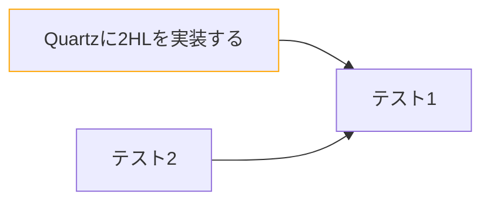

# Quartzに2-Hop-Linkを実装する

[[1E6pdS|Quartz]]にScrapbox(現Cosense)のような2ホップリンクを実装する

## 仕様

[2ホップリンク - namaraii.com](https://namaraii.com/notes/twohop_link)で述べられている通り、
自身のリンク先のバックリンクを2ホップリンクとして表示する

逆に、自身のバックリンクの関連リンクは表示しない

また、1ホップリンクはアウトゴーイングとバックリンクを結合して表示する

1ホップリンク->2ホップリンクの順で表示し、重複は取り除く

## 使い方

- [quartz/components/TwohopLinks.tsx - GitHub](https://github.com/mootah/mootah.github.io/blob/main/quartz/components/TwohopLinks.tsx)
- [quartz/components/scripts/twohoplinks.inline.ts - GitHub](https://github.com/mootah/mootah.github.io/blob/main/quartz/components/scripts/twohoplinks.inline.ts)
- [quartz/components/styles/twohoplinks.scss - GitHub](https://github.com/mootah/mootah.github.io/blob/main/quartz/components/styles/twohoplinks.scss)

を所定の場所に配置して、`quartz/components/index.ts`に取り込む

```ts title="quartz/components/index.ts"
...
import TwohopLinks from "./TwohopLinks"

export {
  ...
  TwohopLinks,
}
```

`quartz/quartz.layout.ts`に設定すれば使用できる

```ts title="quartz/quartz.layout.ts"
...
export const sharedPageComponents: SharedLayout = {
  ...
  afterBody: [
    ...
    Component.TwohopLinks(),
  ],
  ...
}
```

## 動作確認

以下のようにリンクを用意した



[[1E6ne4|2-Hop-Linkのテスト1]]

## 実装

`quartz/components/Backlinks.tsx`をベースに実装した

### データの準備

`Backlinks.tsx`を覗くと、`allFiles`から現在の`slug`を`links`に含むものをフィルタしている

``` tsx title="Backlinks.tsx"
const backlinkFiles = allFiles.filter((file) => (
  file.links?.includes(slug)
))
```

2ホップリンクを実現するには任意のファイルのバックリンクを取得する必要があるので、`slug`をキーにした逆引きマップを作る

```tsx title="TwohopLinks.tsx"
const backlinksMap = allFiles.reduce(
  (map, file) => {
    file.links?.forEach((link) => {
      if (!map[link]) map[link] = []
      map[link].push(file)
    })
    return map
  },
  {} as Record<SimpleSlug, Data[]>,
)
const getBacklinks = (slug: SimpleSlug) => (
  backlinksMap[slug] ?? []
)
```

重複を許さず表示したいので
リンクを既に使っているかどうかを`uniqueLinks`で管理する
indexページと自身のslugを初期値として与える

```ts title="TwohopLinks.tsx"
const uniqueLinks = new Set<SimpleSlug>()
uniqueLinks.add("/" as SimpleSlug)
uniqueLinks.add(slug)
```

`uniqueLinks`を見ながら`outlinkFiles`と`backlinkFiles`を作り
結合して`allLinkFiles`を得る

```tsx title="TwohopLinks.tsx"
const outlinkFiles = allFiles.filter((file) => {
  const s = simplifySlug(file.slug!)
  if (!fileData.links?.includes(s)) return false
  if (uniqueLinks.has(s)) return false
  uniqueLinks.add(s)
  return true
})

const backlinkFiles = getBacklinks(slug).filter((file) => {
  const s = simplifySlug(file.slug!)
  if (uniqueLinks.has(s)) return false
  uniqueLinks.add(s)
  return true
})

const allLinkFiles = outlinkFiles.concat(backlinkFiles)
```

### 表示

`allLinkFiles`を表示する

```tsx title="TwohopLinks.tsx"
{allLinkFiles.map((file) => <li>...</li>)}
```

`outlinkFiles`の各要素に対してバックリンクを表示する

```tsx title="TwohopLinks.tsx"
{outlinkFiles.map((file) => {
  const os = simplifySlug(file.slug!)
  const hops = getBacklinks(os).filter((hop) => {
    const hs = simplifySlug(hop.slug!)
    if (uniqueLinks.has(hs)) return false
    uniqueLinks.add(hs)
    return true
  })
  hops.map((hop) => <li>...</li>)
})}
```