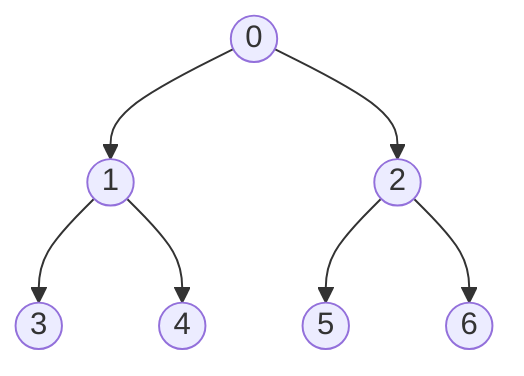

# 幅優先探索（BFS）

## イメージ



## 実装

訪問すべきノードをキューで管理する

```cpp title="bfs.cpp"
queue<int> q;
q.push(0);

while (not q.empty()) {
    int cv = q.front();
    q.pop();
    seen[cv] = true;
    
    each(nv, g[cv]) {
        if (seen[nv]) continue;
        q.push(nv);
    }
}
```

スタックで管理すれば`push`して直ちに`pop`するので[[1Ea7gd|DFS]]になる

## グリッド

迷路など、2次元の[[1Ea8gF|グリッド]]を探索するような場合

```cpp title="bfs.cpp"
queue<pair<int, int>> q;
q.emplace(0, 0);

vector<int> dy = {0, 1, 0, -1};
vector<int> dx = {1, 0, -1, 0};

while (not q.empty()) {
    auto [y, x] = q.front();
    q.pop();
    seen[y][x] = true;

    rep(i, 4) {
        int ny = y + dy[i], nx = x + dx[i];
        if (ny < 0 or h <= ny or nx < 0 or w <= nx) continue;
        if (seen[ny][nx]) continue;

        q.emplace(ny, nx)
    }
}
```

## 参考

- [BFS (幅優先探索) 超入門！ 〜 キューを鮮やかに使いこなす 〜 - Qiita](https://qiita.com/drken/items/996d80bcae64649a6580)