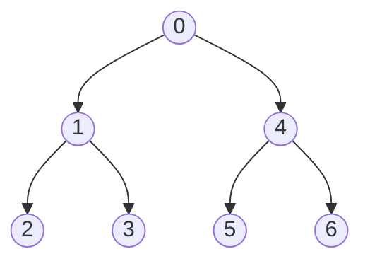

# 深さ優先探索（DFS）

## イメージ



## 実装

[[1Ea7wc|グラフ]]の隣接リスト表現`g`上を探索する

```cpp title="dfs.cpp"
auto dfs = [&](auto self, int cv) -> void {
    seen[cv] = true;
    
    each(nv, g[cv]) {
        if (seen[nv]) continue;
        self(self, nv);
    }
};
```

## 木の場合 

[[1Ea7zx|木]]なら1つ前のノードさえ持っていれば良い

```cpp title="dfs.cpp"
auto dfs = [&](auto self, int cv, int pv) -> void {
    seen[cv] = true;
    
    each(nv, g[cv]) {
        if (nv == pv) continue;
        self(self, nv);
    }
};
```

## バックトラック

一筆書きを探索する場合は`seen`を戻してやれば良い

```cpp title="dfs.cpp"
auto dfs = [&](auto self, int cv) -> void {
    seen[cv] = true;
    
    each(nv, g[cv]) {
        if (seen[nv]) continue;
        self(self, nv);
    }
    seen[cv] = false;
};
```

ただし、グリッド上でやると $O(4^{HW})$ かかる

## 参考

- [DFS (深さ優先探索) 超入門！ 〜 グラフ・アルゴリズムの世界への入口 〜【前編】 - Qiita](https://qiita.com/drken/items/4a7869c5e304883f539b)
- [よくやる再帰関数の書き方 〜 n 重 for 文を機械的に 〜 - けんちょんの競プロ精進記録](https://drken1215.hatenablog.com/entry/2020/05/04/190252)
- [グリッド問題でdfsのバックトラックは指数時間でO(4^HW)がかかってTLEします - Qiita](https://qiita.com/rMJ2pwyc4U/items/f26bfc9612259197bb09)

## 関連

- [[1Ea7Lx|幅優先探索（BFS）]]
- いもす法